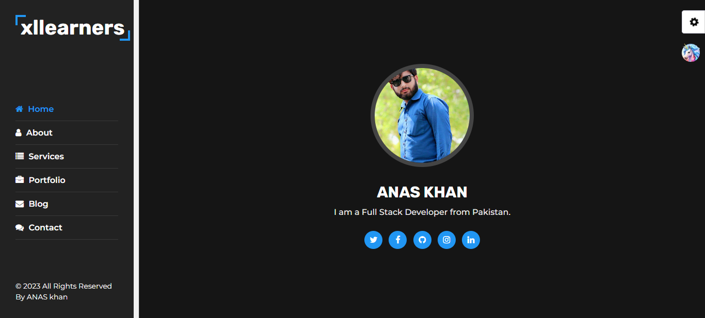

# Al Portfolio

> awesome portfolio website using html, css & js.

<br/>

[](https://github.com/alsiam/alfolio/blob/master/LICENSE.md)  

<p align="center">
  <a href="https://portfolio-anas-khan.netlify.app" target="_blank"></a> 
  <a href="https://github.com/ak47ak47/portfolio-Anas-khan.github.io/fork" target="_blank"></a> 
  <a href="https://github.com/ak47ak47/portfolio-Anas-khan.github.io/archive/refs/heads/main.zip" target="_blank"></a> 
</p>

## [Live Preview](https://alfolio.netlify.app)

<h2 align="center">
  
  <br>
</h2>

## Features

⚡️ Modern UI Design + Reveal Animations\
⚡️ One Page Layout\
⚡️ Styled with Vanila CSS\
⚡️ Fully Responsive\
⚡️ Valid HTML5 & CSS3\
⚡️ Well organized documentation

<br/>

## Why do you need a portfolio? ☝️

- Professional way to showcase your work
- Increases your visibility and online presence
- Shows you’re more than just a resume

<br/>

```bash
# Clone the repository
$ git clone https://github.com/ak47ak47/portfolio-Anas-khan.github.io.git
# Move into the repository
$ cd portfolio-Anas-khan.github.io
# Remove the current origin repository
$ git remote remove origin
```

<br/>

## Release History

- 0.1.0
  - The first proper release
- 0.0.1

  - Work in progress

  <br/>
